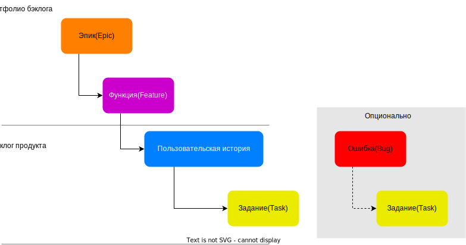
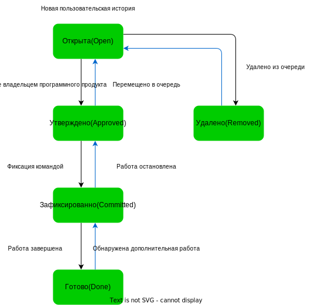

# **Описание рабочего процесса Agile**

## **Введение**

Agile - это методология разработки программного обеспечения, которая основывается на итеративном и инкрементальном подходе к разработке. Она позволяет командам быстро адаптироваться к изменениям в требованиях и быстро доставлять ценность для клиентов.

Рабочий процесс Agile состоит из нескольких этапов:

  * Планирование: команда определяет цели и задачи проекта, а также определяет, как они будут достигаться.
  * Разработка: команда начинает работу над проектом, создавая инкрементальные версии продукта.
  * Оценка: команда оценивает продукт и определяет, что нужно изменить или улучшить.
  * Демонстрация: команда демонстрирует продукт заказчику и получает обратную связь.
  * Итерация: команда повторяет процесс, улучшая продукт на каждом этапе.

Ключевыми принципами Agile являются:

  * Коммуникация и сотрудничество: команда работает вместе, обмениваясь идеями и обратной связью.
  * Гибкость: команда быстро адаптируется к изменениям в требованиях и окружении.
  * Инкрементальность: продукт разрабатывается постепенно, с каждой итерацией добавляется новый функционал.
  * Качество: команда стремится к созданию высококачественного продукта.

Рабочий процесс Agile позволяет командам быстро доставлять ценность для клиентов и адаптироваться к изменениям в требованиях. Он также способствует улучшению коммуникации и сотрудничества в команде.

## **Этапы**

### **Планирование**

Планирование - это первый этап рабочего процесса Agile. В этом этапе команда определяет цели и задачи проекта, а также определяет, как они будут достигаться.

Планирование включает в себя следующие этапы:

  * Определение целей: команда определяет цели проекта, которые должны быть достигнуты в конце итерации.
  * Определение задач: команда определяет задачи, которые должны быть выполнены в течение итерации.
  * Определение приоритетов: команда определяет приоритеты задач, чтобы понять, какие задачи должны быть выполнены первыми.
  * Определение сроков: команда определяет сроки выполнения задач, чтобы понять, когда задачи должны быть завершены.
  * Определение ресурсов: команда определяет ресурсы, которые необходимы для выполнения задач.
  * Определение критериев готовности: команда определяет критерии готовности задач, чтобы понять, когда задача будет считаться выполненной.
  * Определение ограничений: команда определяет ограничения, которые могут повлиять на выполнение задач.

### **Разработка**

Разработка - это второй этап рабочего процесса Agile. В этом этапе команда начинает работу над проектом, создавая инкрементальные версии продукта.

Разработка включает в себя следующие этапы:

  * Выполнение задач: команда выполняет задачи, которые были определены на этапе планирования.
  * Создание инкрементов: команда создает инкрементальные версии продукта, добавляя новый функционал.
  * Оценка продукта: команда оценивает продукт и определяет, что нужно изменить или улучшить.
  * Демонстрация продукта: команда демонстрирует продукт заказчику и получает обратную связь.
  * Итерация: команда повторяет процесс, улучшая продукт на каждом этапе.

### **Оценка**

Оценка - это третий этап рабочего процесса Agile. В этом этапе команда оценивает продукт и определяет, что нужно изменить или улучшить.

Оценка включает в себя следующие этапы:

  * Оценка продукта: команда оценивает продукт и определяет, что нужно изменить или улучшить.
  * Оценка задач: команда оценивает задачи, которые были выполнены в течение итерации.
  * Оценка процесса: команда оценивает процесс разработки продукта и определяет, что нужно изменить или улучшить.
  * Оценка команды: команда оценивает свою работу и определяет, что нужно изменить или улучшить.

### **Демонстрация**

Демонстрация - это четвертый этап рабочего процесса Agile. В этом этапе команда демонстрирует продукт заказчику и получает обратную связь.

Демонстрация включает в себя следующие этапы:

  * Демонстрация продукта: команда демонстрирует продукт заказчику и получает обратную связь.
  * Оценка продукта: команда оценивает продукт и определяет, что нужно изменить или улучшить.
  * Оценка процесса: команда оценивает процесс разработки продукта и определяет, что нужно изменить или улучшить.
  * Оценка команды: команда оценивает свою работу и определяет, что нужно изменить или улучшить.

## **Типы элементов рабочего процесса**

Типы рабочих элементов процесса Agile помогают команде планировать и управлять проектом. В зависимости от типа элемента процесса Agile команда может определить, какие задачи должны быть выполнены в течение итерации.

Чтобы получить преставление о портфеле элементов процесса Agile, взгляните на следующую схему:

Рабочий процесс состоит из следующих типов элементов:

  * [Эпик](dictionary/epic.md)
  * [Функция](dictionary/feature.md)
  * [Пользовательская история](dictionary/user-story.md)
  * [Ошибка](dictionary/bug.md)
  * [Задание](dictionary/task.md)

### **Определение пользовательских историй**

Пользовательские истории определяют приложения, требования и элементы, которые командам необходимо создать. Определяют и ранжируют пользовательские истории обычно владельцы продукта. Затем команда оценивает трудозатраты и объем работ, необходимые для поставки элементов с наивысшим приоритетом.

Чтобы получить представление о портфеле функций, сценариев или пользовательского интерфейса, владельцы продуктов и руководители программ сопоставляют истории пользователей с функциями. Когда команда работает в спринтах, она определяет задачи, которые автоматически связываются с пользовательскими историями.

Пользовательские истории определяются для управления невыполненной работой. Они должны быть достаточно маленькими, чтобы быть выполненными в течение одной итерации.

Работая с пользовательскими историями, указывайте достаточно сведений для оценки требуемого для реализации истории объема работы. Сконцентрируйтесь на том, для кого предназначена функция, чего желают достичь пользователи и почему. Не описывайте, как следует разрабатывать эту функцию. Предоставьте достаточно сведений, чтобы команда могла создавать задачи и тестовые случаи для реализации элемента.

### **Определение эпиков**

Эпики, как правило, создаются для группировки функций, которые связаны с одной целью. Эпики могут быть связаны с пользовательскими историями, задачами или функциями.

### **Сопоставление пользовательских историй с функциями и эпиками**

Пользовательские истории группируются в функции, которые в свою очередь группируются в эпики.

### **Определение заданий**

Задания определяются для управления невыполненной работой. Они должны быть достаточно маленькими, чтобы быть выполненными в течение одной итерации.

С помощью гибких процессов команды прогнозируют работу и определяют задания в начале каждого спринта. Затем каждый участник команды выполняет подмножество этих заданий. Задания могут включать разработку, тестирование и другие виды работ. Например, разработчик определяет задания для реализации пользовательских историй, а тестировщик определяет задания для написания и выполнения тестовых случаев.

### **Определение ошибок**

Ошибки определяются для управления невыполненной работой. Они должны быть достаточно маленькими, чтобы быть выполненными в течение одной итерации.

Ошибки создаются в результате тестирования или эксплуатации решения. Ошибки могут быть связаны с пользовательскими историями, задачами или функциями.

## **Состояния рабочего процесса**

| Пользовательская история | Эпик | Функция | Ошибка | Задание |
| --- | --- | --- | --- | --- |
|  |  |  |  |  |

___

### **Типичное выполнение рабочего процесса для пользовательской истории/эпика/функции/ошибки:**

* Владелец продукта создает элемент в состоянии **Открытая**.
* Владелец продукта перемещает элемент в состояние **Утвержден** после того, как он будет достаточно описан и готов, чтобы команда оценила уровень усилий по его реализации. В большинстве случаев элемент в верхней части невыполненной работы по продукту находится в состоянии **Утверждено**, а элемент в середине и внизу находится в состоянии **Открыта**.
* Команда обновляет состояние на **Зафиксировано**, когда она решает зафиксировать работу по элементу во время спринта.
* Элемент перемещается в состояние **Готово**, когда команда выполнила все связанные с ним элементы и владелец продукта соглашается с тем, что он был реализован в соответствии с условиями принятия.

### **Типичное выполнение рабочего процесса для задания:**

* Член команды** создает задание в состоянии **Открыто**.
* Член команды** перемещает задание в состояние **В работе**, когда он начинает работу над ним.
* Член команды** перемещает задание в состояние **Готово**, когда он завершает работу над ним.

> ** Член команды - это человек, который выполняет задание. Это может быть аналитик, разработчик, тестировщик или другой член команды.